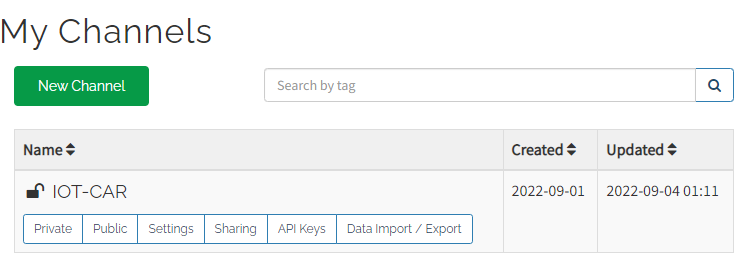
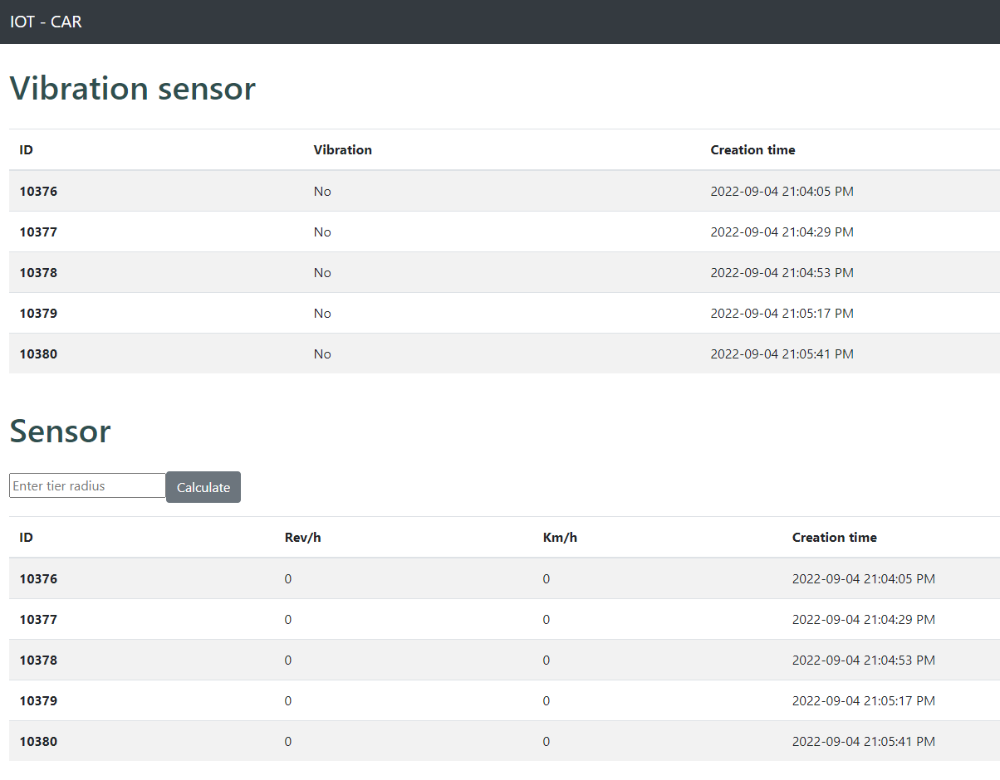

# IOT CARS 

This project was generated with [Angular CLI](https://github.com/angular/angular-cli) version 8.3.0.

## Development server

* Run `npm install` to install dependencies. 
* Run `ng serve` for a dev server. 
* Navigate to `http://localhost:4200/`. 
* The app will automatically reload if you change any of the source files.

## Description

* The application is connecting with a cloud server called [Thingspeak](https://thingspeak.com/).
* The cloud server is integrated with an internet-of-things prototype sensor system.
* The iot-cars UI ingests data from a configured [thingspeak-channel](https://thingspeak.com/channels/1846905/private_show).

## Further help

To get more help on the Angular CLI use `ng help` or go check out the [Angular CLI README](https://github.com/angular/angular-cli/blob/master/README.md).
